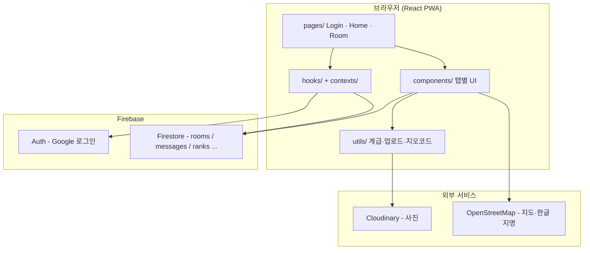

# WURI 코드 리뷰 & 공부 가이드

> 친구들만 쓰는 비밀 아지트 앱 **WURI(우리)** 의 코드를 이해하고, 직접 고쳐보며 공부하기 위한 문서입니다.  
> 배포: https://wuri-iota.vercel.app · 저장소: `mercury51666-cloud/wuri`

---

## 1. 이 앱이 뭔가요?

| 한 줄 요약 | Firebase 기반 **친구 전용 방(Room)** 앱 — 채팅, 사진, 일정, 기분, 위치, 계급 게임 |
|-----------|--------------------------------------------------------------------------------|
| 누가 쓰나 | Google 로그인한 사람만, 초대 링크/비밀번호로 방 입장 |
| 핵심 UX | 카카오톡 + 젠리(위치) + 군대식 계급(포인트/벙어리/경례)을 섞은 친구용 PWA |

**공부할 때 기억할 구조:**

```
브라우저 → React 화면 → Firebase Auth(로그인) + Firestore(실시간 DB) + Cloudinary(사진)
```

---

## 2. 기술 스택 (뭘 배우고 있는지)

| 분류 | 기술 | 어디서 쓰나 |
|------|------|------------|
| UI | React 19 + TypeScript | 모든 `.tsx` 파일 |
| 빌드 | Vite 8 | `vite.config.ts` |
| 스타일 | Tailwind CSS 4 + `index.css` | 클래스명 + CSS 변수 |
| 라우팅 | react-router-dom 7 | `App.tsx` |
| 백엔드 | Firebase Auth + Firestore | `firebase.ts`, 각 페이지 |
| 사진 | Cloudinary (무료 업로드) | `utils/cloudinary.ts` |
| 지도 | Leaflet + OpenStreetMap | `LocationMap.tsx` |
| PWA | vite-plugin-pwa | 홈 화면 추가, 오프라인 캐시 |

**환경 변수** (로컬 `.env` 또는 Vercel에 설정):

- `VITE_FIREBASE_*` — Firebase 프로젝트 연결
- `VITE_CLOUDINARY_*` — 사진 업로드

---

## 3. 앱이 켜질 때 흐름

```
index.html
   └── main.tsx          ← React 앱 시작, CSS 로드
         └── App.tsx     ← 로그인 확인 + 라우팅
               ├── /login      → LoginPage (Google 로그인)
               ├── /           → HomePage (방 목록, 만들기/참여)
               └── /room/:id   → RoomPage (채팅·갤러리·일정·더보기)
```

### `App.tsx`에서 꼭 볼 것

1. **`useAuthState()`** — Firebase 로그인 여부를 구독. 로딩 중이면 스피너.
2. **`RequireAuth`** — 비로그인 시 `/login`으로 보냄. `/room/xxx` 초대 링크는 `sessionStorage`에 저장해 두었다가 로그인 후 복귀.
3. **`ThemeProvider` / `ToastProvider`** — 전역 다크모드, 하단 토스트.

```tsx
// App.tsx 핵심 패턴
<Route path="/room/:roomId" element={
  <RequireAuth user={user}><RoomPage /></RequireAuth>
} />
```

**공부 포인트:** React Router의 `Navigate`, `useLocation`, `state`로 “로그인 후 원래 페이지로” 패턴을 익히세요.

---

## 4. 폴더 & 파일 지도

```
wuri/
├── index.html              # PWA 메타, #root
├── vite.config.ts          # React + Tailwind + PWA 플러그인
├── firestore.rules         # Firestore 보안 규칙 (콘솔에 붙여넣기 필요)
├── vercel.json             # SPA 라우팅 (새로고침 404 방지)
│
└── src/
    ├── main.tsx            # 진입점
    ├── App.tsx             # 라우트 + Auth 가드
    ├── firebase.ts         # Firebase 초기화
    ├── index.css           # Tailwind + 디자인 토큰 + 커스텀 클래스
    │
    ├── pages/              # ★ 화면 단위 (페이지)
    │   ├── LoginPage.tsx   # Google 로그인, 인앱브라우저 경고
    │   ├── HomePage.tsx    # 내 방 목록, 방 만들기/코드로 참여
    │   └── RoomPage.tsx    # ★★★ 가장 큰 파일 — 방 안 모든 기능
    │
    ├── components/         # ★ 재사용 UI 조각
    │   ├── RoomBottomNav.tsx    # 하단 탭 (채팅/사진/일정/더보기)
    │   ├── RoomMorePanel.tsx    # 더보기 메뉴 (기분/미션/지도/계급)
    │   ├── LocationMap.tsx      # 친구 지도 (젠리 스타일)
    │   ├── MoodBoard.tsx        # 오늘 기분
    │   ├── ScheduleCalendar.tsx # 약속 일정
    │   ├── EventRsvp.tsx        # 참석/불참/미정
    │   ├── DailyMission.tsx     # 오늘의 미션 (OOTD 사진 + 추천 노래)
    │   ├── PhotoGallery.tsx     # 채팅 사진 모아보기
    │   ├── RankBoard.tsx        # 계급 순위
    │   ├── PollMessage.tsx      # 채팅 속 투표
    │   ├── ProfileModal.tsx     # 프로필 수정
    │   └── ... (기타 UI)
    │
    ├── hooks/              # ★ React 커스텀 훅
    │   ├── useAuthState.ts      # 로그인 상태
    │   ├── useUserProfiles.ts   # users/{uid} 프로필 캐시
    │   ├── useReadStatus.ts     # 안 읽은 메시지 계산
    │   ├── useNotifications.ts  # 탭 숨김 시 브라우저 알림
    │   └── useRoomExtras.ts     # 투표, 예약 메시지, 생일
    │
    ├── contexts/           # ★ 전역 Context
    │   ├── ThemeContext.tsx     # 다크모드
    │   └── ToastContext.tsx     # 토스트 메시지
    │
    └── utils/              # ★ 순수 로직 (React 없음)
        ├── rankSystem.ts        # 계급 이름·포인트 상수
        ├── roomPoints.ts        # 포인트 적립/저장
        ├── rankPowers.ts        # 벙어리·경례 규칙
        ├── rankEvents.ts        # 입장 환영·승진 시스템 메시지
        ├── cloudinary.ts        # 사진 업로드
        ├── joinCode.ts          # 방 비밀번호 생성/검증
        ├── mentions.tsx         # @멘션 파싱
        ├── reverseGeocodeKo.ts  # 위도경도 → 한글 동·구
        └── roomFeatures.ts      # 생일 등 헬퍼
```

### 파일 크기 & 난이도 (공부 순서 참고)

| 난이도 | 파일 | 왜? |
|--------|------|-----|
| ⭐ 입문 | `main.tsx`, `App.tsx`, `LoginPage.tsx` | 라우팅·로그인만 |
| ⭐⭐ | `HomePage.tsx`, `MoodBoard.tsx`, `LocationMap.tsx` | Firestore 읽기/쓰기 패턴 |
| ⭐⭐⭐ | `hooks/*`, `utils/roomPoints.ts` | 로직 분리, 재사용 |
| ⭐⭐⭐⭐ | `RoomPage.tsx` | 채팅+계급+모달+탭이 한 파일에 |

---

## 5. 기능별 — 어떤 파일을 보면 되나

### 하단 탭 구조 (`RoomBottomNav.tsx`)

| 탭 | 화면 | 주요 파일 |
|----|------|----------|
| 채팅 | 실시간 대화 | `RoomPage.tsx` |
| 사진 | 갤러리 | `PhotoGallery.tsx` |
| 일정 | 달력 + RSVP | `ScheduleCalendar.tsx`, `EventRsvp.tsx` |
| 더보기 → 기분 | 오늘 mood | `MoodBoard.tsx` |
| 더보기 → 미션 | OOTD·추천 노래 미션 | `DailyMission.tsx` |
| 더보기 → 친구 지도 | 위치 공유 | `LocationMap.tsx`, `reverseGeocodeKo.ts` |
| 더보기 → 계급 | 순위·포인트 | `RankBoard.tsx`, `RoomStats.tsx` |

### 채팅 부가 기능 (`RoomPage.tsx` + hooks)

| 기능 | 설명 | 관련 코드 |
|------|------|----------|
| 답장 | 메시지에 replyTo | `RoomPage.tsx` sendMessage |
| @멘션 | 이름 태그 | `utils/mentions.tsx` |
| 이모지 반응 | 👍❤️ 등 | `RoomPage.tsx` toggleReaction |
| 투표 | 채팅 속 poll | `useRoomExtras.ts`, `PollMessage.tsx` |
| 예약 메시지 | sendAt 이후 전송 | `useRoomExtras.ts` (15초마다 클라이언트 체크) |
| 벙어리 10초 | 계급 높은 사람 → 낮은 사람 | `rankPowers.ts`, `RoomPage.tsx` |
| 경례 | 계급 예의 | `rankPowers.ts` |
| 입장 환영 | "{이름}님이 입장했습니다" | `rankEvents.ts` postJoinWelcome |

---

## 6. Firestore 데이터 구조 (DB 설계)

Firestore는 **문서(document)** 와 **컬렉션(collection)** 으로 데이터를 저장합니다.

### 최상위

```
rooms/{roomId}
  ├── name, joinCode, memberIds[], createdBy, createdAt, photoURL?, emoji?

users/{uid}                    ← 앱에서 사용, rules에는 없음 (콘솔에서 별도 설정 필요)
  ├── displayName, photoURL, birthday?
```

### `rooms/{roomId}` 아래 하위 컬렉션

| 경로 | 문서 ID | 저장 내용 |
|------|---------|----------|
| `messages/{id}` | auto | 채팅 텍스트/사진, 반응, 답장, 투표, 계급 이벤트 |
| `readStatus/{userId}` | uid | 마지막으로 읽은 시각 |
| `typing/{userId}` | uid | "○○이 입력 중…" |
| `moods/{userId}` | uid | 오늘 기분 이모지 |
| `locations/{userId}` | uid | lat, lng, updatedAt |
| `ranks/{userId}` | uid | points, rankName, 주간/일일 카운트 |
| `mutes/{userId}` | 대상 uid | 벙어리 만료 시각 |
| `meta/photoMission_날짜` | 날짜키 | 오늘 미션 사진 목록 |
| `scheduledMessages/{id}` | auto | 예약 전송 대기 |
| `events/{id}` | auto | 일정 (제목, 날짜, 시간) |
| `events/{id}/rsvp/{userId}` | uid | yes / no / maybe |
| `streaks/{userId}` | uid | 미션 연속일 — **rules에 없음, 주의** |

### 실시간 구독 패턴 (거의 모든 기능의 핵심)

```tsx
useEffect(() => {
  const ref = collection(db, 'rooms', roomId, 'messages')
  const unsub = onSnapshot(ref, (snap) => {
    const list = snap.docs.map(d => ({ id: d.id, ...d.data() }))
    setMessages(list)
  })
  return () => unsub()   // ← 컴포넌트 unmount 시 구독 해제 (필수!)
}, [roomId])
```

**공부 포인트:** `onSnapshot` = 서버 데이터가 바뀌면 자동으로 화면 갱신. 카카오톡처럼 실시간인 이유.

---

## 7. 계급 시스템 (WURI만의 재미)

```
메시지 보냄 / 미션 완료 → roomPoints.ts에서 points 증가
                        → rankSystem.ts 기준으로 계급 결정 (이병 → … → 상사)
                        → 승진 시 rankEvents.ts가 채팅에 축하 메시지
                        → rankPowers.ts로 벙어리·경례·호칭(님) 적용
```

| 파일 | 역할 |
|------|------|
| `rankSystem.ts` | 계급 목록, 필요 포인트, 반응 이모지 권한 |
| `roomPoints.ts` | Firestore `ranks` 문서 읽기/쓰기, 포인트 지급 |
| `rankPowers.ts` | “내가 상대보다 계급·점수가 높을 때만” 같은 규칙 |
| `rankEvents.ts` | 시스템 메시지 (입장, 승진) |

**따라가기 좋은 연습:** 채팅 전송 버튼 → `sendMessage` → `awardMessagePoints` → `ranks` 문서 → `RankBoard` UI 갱신

---

## 8. 스타일링은 어떻게?

1. **Tailwind** — JSX에 `className="flex gap-2 rounded-2xl ..."`
2. **CSS 변수** — `index.css`의 `--brand`, `--surface` (라이트/다크)
3. **커스텀 클래스** — `.chat-bubble`, `.zenly-map-shell`, `.tab-bar` 등

다크모드: `ThemeContext`가 `<html>`에 `.dark` 클래스 추가 → `@custom-variant dark`로 Tailwind + CSS가 함께 반응.

---

## 9. 코드 리뷰 — 잘한 점 👍

1. **실시간 Firestore 패턴이 일관됨** — `useEffect` + `onSnapshot` + cleanup
2. **초대 링크 UX** — 비로그인 `/room/id` → 로그인 → 다시 방으로
3. **계급 로직 분리** — UI(`RoomPage`)와 규칙(`utils/`)이 나뉘어 있음
4. **한국 사용자 UX** — 인앱브라우저(카톡/인스타) 로그인 차단, 한글 카피, PWA
5. **무료 스택** — OSM 지도, Cloudinary, Carto/OSM 타일 (API 키 없이 동작)

---

## 10. 코드 리뷰 — 개선하면 배울 것도 많은 곳 🔧

| 항목 | 현재 | 왜 신경 쓰나 | 연습 아이디어 |
|------|------|-------------|--------------|
| **`RoomPage.tsx` 너무 큼** (~1200줄+) | 채팅·탭·모달·계급 한 파일 | 유지보수 어려움 | `useRoomChat(roomId)` 훅으로 채팅만 분리 |
| **예약 메시지** | 15초마다 클라이언트가 확인 | 앱 안 켜져 있으면 안 감 | Cloud Functions 배우면 서버 트리거 |
| **Cloudinary 업로드** | 3곳에 비슷한 코드 | 중복 | `cloudinary.ts` 하나만 쓰게 통합 |
| **`firestore.rules` vs 코드** | `users`, `streaks` rules 누락 | 보안 구멍 | rules와 `collection(db,...)` 전부 대조 |
| **`ranks` write** | 방 멤버면 누구나 쓰기 가능 | 포인트 조작 가능 | `request.auth.uid == userId`로 제한 |
| **프로필 캐시** | `useUserProfiles` 일회 fetch | 친구가 이름 바꿔도 안 바뀜 | `onSnapshot`으로 users 구독 |

이 목록은 “틀렸다”기보다 **다음에 실력 올릴 때 손대볼 과제**입니다.

---

## 11. 공부 로드맵 (추천 순서)

### 1단계 — React 기초 + 앱 뼈대
- [ ] `main.tsx` → `App.tsx` → `LoginPage.tsx` 읽기
- [ ] `useState`, `useEffect`가 뭔지 MDN/React 문서
- [ ] `react-router-dom` 튜토리얼 (Route, Navigate)

### 2단계 — Firebase
- [ ] `firebase.ts`, `useAuthState.ts`
- [ ] Firestore: `doc`, `collection`, `setDoc`, `onSnapshot` 공식 문서
- [ ] `HomePage.tsx`에서 방 만드는 코드 한 줄씩 따라치기

### 3단계 — 실시간 채팅
- [ ] `RoomPage.tsx`에서 `messages` 구독 부분만 찾기
- [ ] `sendMessage` → Firestore `addDoc` 흐름 그리기
- [ ] 연습: “안녕 전용 이모지 반응 하나 추가”

### 4단계 — 컴포넌트 분리
- [ ] `MoodBoard.tsx`, `LocationMap.tsx` (작고 독립적)
- [ ] `hooks/useRoomExtras.ts` (로직만 모음)

### 5단계 — 게임/규칙
- [ ] `rankSystem.ts` → `roomPoints.ts` → `RankBoard.tsx`
- [ ] 연습: 새 계급 이름 하나 추가 or 포인트 수치 조정

### 6단계 — 배포 & 보안
- [ ] `firestore.rules` 읽고 Firebase 콘솔과 비교
- [ ] Vercel 환경 변수, `npm run build` 의미

---

## 12. 직접 해보면 좋은 미니 과제

1. **기분 이모지 하나 추가** — `MoodBoard.tsx`의 `MOODS` 배열
2. **입장 환영 문구 바꾸기** — `rankEvents.ts`의 `postJoinWelcome`
3. **친구 지도 기본 줌 변경** — `LocationMap.tsx`의 `zoom={15}`
4. **토스트 메시지 커스텀** — `ToastContext.tsx` 스타일
5. **rules에 `users` 추가** — Firebase 문서 보며 본인 uid만 write

---

## 13. 자주 쓰는 명령어

```bash
cd wuri
npm run dev      # 로컬 개발 (http://localhost:5173)
npm run build    # 배포 전 타입체크 + 빌드
npm run preview  # 빌드 결과 미리보기
```

---

## 14. 한 장 요약 다이어그램



---

## 15. 더 물어볼 때

이 문서 보면서 **“이 파일 이 줄이 이해 안 돼”** 하면, 파일 경로와 줄 번호를 알려주면 그 부분만 풀어서 설명해 줄 수 있어요.

**마지막 업데이트:** 2026-06-24 · 커밋 `9f4c1a0` 기준 (친구 지도 한글 지역명, 젠리 UI)
